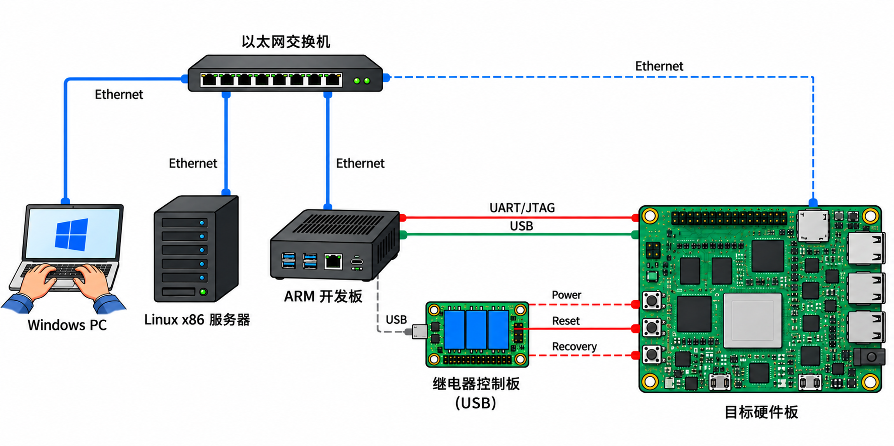

# Embedded Debug MCP Server

## 架构


```
                         ┌────────────────────────┐
                         │    Ethernet Switch     │
                         └─┬──────┬──────┬──────┬┘
                           │      │      │      │
                  Ethernet │      │      │      │ Ethernet
                           │      │      │      │
          ┌────────────────┘      │      │      └──-───────────────────────────┐
          │                       │      └───-───-───┐                         │
          ▼                       ▼                  ▼                         ▼

┌──────────────────┐   ┌──────────────────┐   ┌───────────────┐         ┌──────────────────┐
│ Windows PC       │   │ Build Machine    │   │ ARM           │──UART───│ Target Board     │
│                  │   │ Linux x86        │   │               │──USB────│                  │
│ SSH / Client     │   │                  │   │               │.........│ ○ RECOVERY       │
│                  │   │ Claude Code      │   │ ser2net       │─────────│ ○ RESET          │
│                  │   │ MCP Server       │   │ USB Host      │.........│ ○ Power          │
└──────────────────┘   └──────────────────┘   └───────────────┘         └──────▲────▲──────┘
```

### 工作流

```
1. 构建         cargo install --git https://github.com/bitshelf/sermcp --locked --target x86_64-unknown-linux-musl
2. 配置         dutabo init              (在项目根目录；或 vi .target.jsonc)
3. 部署         vi .mcp.json             (或依赖 hook)
4. 启动         claude                   (Claude Code 自动 spawn MCP Server)
5. 使用         serial_send_command "uname -a"
6. 查看日志     tail -f .dut-serial/mcp.log
```


## 使用方法 

在项目根目录创建 `.target.jsonc`，用 `dutabo init` 交互式创建/更新, 可以使用图形界面进行测试。
`.mcp.json` 缺失或没有`sermcp` 条目时，`dutabo init` 会自动创建/补齐该条目（已有条目则原样保留）。

- `.mcp.json`
```json
{
  "mcpServers": {
    "sermcp": {
      "command": "sermcp",
      "args": []
    }
  }
}
```

```bash
# 确认项目有 .target.jsonc
ls -la .target.jsonc .mcp.json

# 启动 Claude Code 后查看状态栏
# 成功时会显示: ● serial:active 或 ● serial:disconnected
```

### 日志

- 运行时日志写入 `{project}/.dut-serial/mcp.log`。
- 串口数据日志写入 `{project}/.dut-serial/logs/boot-NNN_*.log`。

### 多 Agent 共享与占用状态（busy / dutabo）

多个代码 Agent 在同一项目打开时共享一个 MCP server。第一个 Agent
会话是 Owner，后续会话是 ReadOnly guest。

- `dutabo` — `dutabo serial` 交互会话持有串口；对**所有**会话生效（引擎状态
  机真实转移到 `Dutabo`）；
- `busy` — 另一个 Agent 会话持有 MCP，本会话只读（控制类工具被
  `agent_read_only` 拒绝）；

### 故障排除

| 现象 | 原因 | 解决 |
|------|------|------|
| 状态栏不显示 | 无 `.target.jsonc` 或 Server 未启动 | 检查项目根目录; 运行 `--log-to-stderr -v` 调试 |
| `disconnected` | 连不上 ser2net | 检查 IP/端口; `nc -zv host port` |
| `DUT-off` | 目标无输出 | `serial_send_command "echo ping"`; `serial_reset` |
| 二进制不启动 | 依赖库缺失 | 检查动态链接: `ldd target/release/sermcp` |
| 第二个实例被拒 | 同 host:port 互斥 | 退出第一个实例或等它释放锁 |

## 构建

```bash
cd sermcp
rustup target add x86_64-unknown-linux-musl
cargo musl
```

### 测试

```bash
# 运行全部单元测试
cargo test

# 运行特定模块测试
cargo test boot_detector
cargo test command_queue
cargo test mcp

# 查看测试覆盖率报告
cargo test -- --nocapture
```
